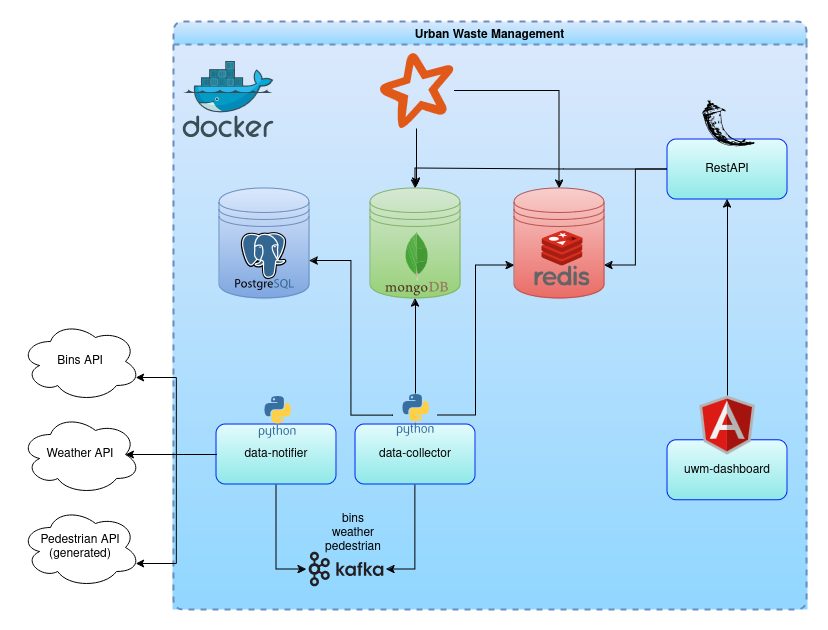

# Urban Waste Management

## How to run the application

Ensure to have Docker installed on the machine.

For a fast start, run the following command:

```
docker compose up --build -d
```

With the `-d` option, the terminal can be closed since it is detached from the containers.

If redis is already in use, try: `sudo systemctl stop redis-server` before running the compose up.

## How it works
The data-notifier component retrieves data from various sources, including the Bins/Weather Australian APIs and a synthetic data generator that simulates pedestrian counts based on historical data. This data is then transmitted via Kafka messages to the data-collector, whose primary role is to store the data in MongoDB (for all types of data, including historical data obtained from CSV files) and PostgreSQL (for static data, such as device IDs).

Subsequently, the data undergoes processing using Spark to generate predictions and calculate the optimal routing algorithms. Additional data required for the dashboard is fetched from MongoDB using Spark and then passed through the backend, utilizing Redis for efficient data handling and delivery.

The backend component is responsible for retrieving the processed data and serving it to the frontend component (uwm-dashboard repository) using Flask, ensuring smooth and efficient communication between the server and the user interface.

<div align="center">
  
</div>  

## Web services
- **MongoDB**: [http://localhost:8081/](http://localhost:8081/)
- **Kafka UI**: [http://localhost:9000/](http://localhost:9000/)
- **Spark Worker**: [http://localhost:7077/](http://localhost:7077/)
- **Web Application**: [http://localhost:4200/](http://localhost:4200/) (Start using the `uwm-dashboard` repository)


Project for Big Data Technology Course 2023/2024

